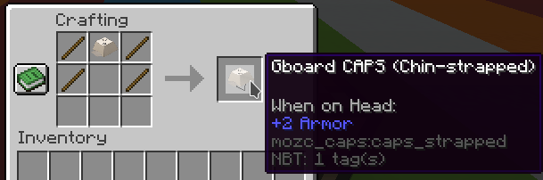

# gCAPS
Reimplementation of the [Gboard CAPS](https://landing.google.co.jp/caps/) in Minecraft, now enhanced with AI (Atama Input)!  
Supports Minecraft >= 1.20 with the Fabric/Quilt modloader.

## Crafting Recipe

## Usage
1. Wear the Gboard CAPS
2. Press the Y key (Configurable in control settings)
3. Move your head around to select characters.
4. Left click to type, Middle click to change layout, Right click to send the message!

## Bugs/Suggestions
~~This is not an officially supported mod, and is released under OSS license without any warranty nor user support /j~~

If you have any suggestions or bug report, don't hesitate to open an GitHub issue [here](https://github.com/Kenny-Hui/gcaps-fabric/issues)!
## License
This project is licensed under the MIT License.